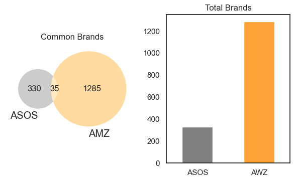
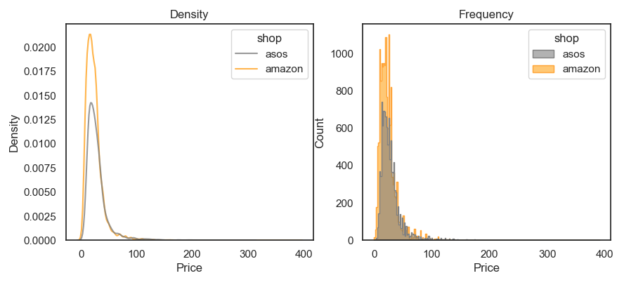
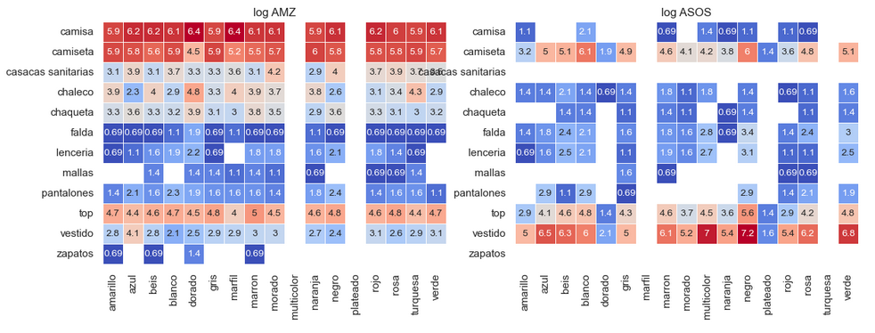
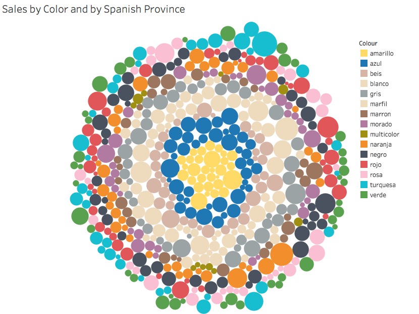
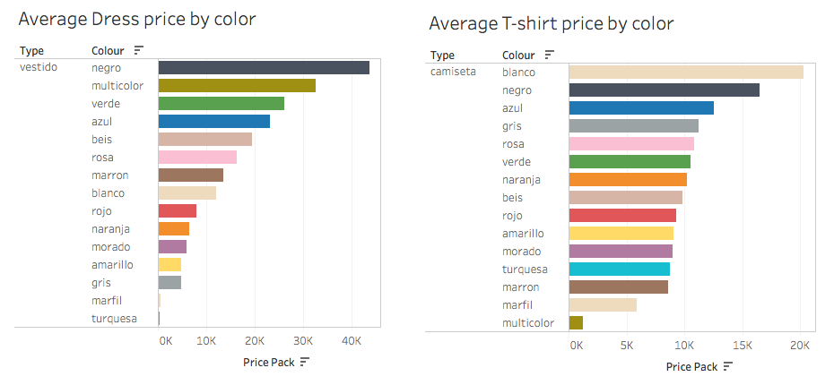
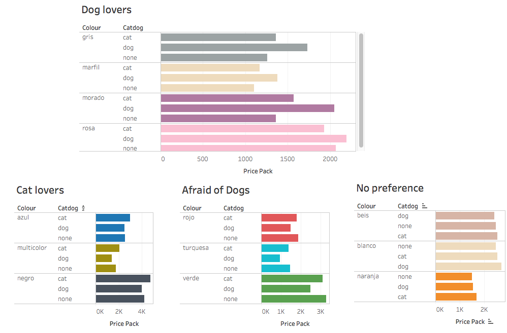
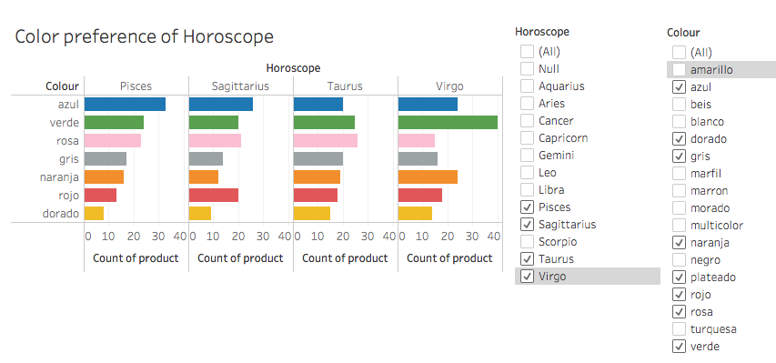

# The Color Currency:   Decoding the Best-Selling Hue (2)

### `EDA_VIZ_project` to investigate the best-selling colour of women t-shirt and dresses available in `Amazon.es` and `ASOS.es`

This project is a continuation from the `ETL_project` available at: **https://github.com/maluque/ETLproject**

In the ever-evolving landscape of e-commerce, our consulting company has embarked on an exciting new data analysis project with a unique twist.

Our client, an eccentric enterprise with passion for `astrology and animal advocacy`, has envisioned the creation of an intermediary online clothing store, named **`AstroPaws Co.`**. The store will specialize in offering a curated selection of `women's t-shirts and dresses` sourced from two distinct realms: the vast marketplace of `Amazon` and the trendy offerings from various brands available on the `ASOS` website.

**Our mission is clear:** delve into the data to `identify the best-selling clothing` items that `resonate with` individuals who share a similar passion for `astrology` and an appreciation for `animal rights`.

 

--------------

 

## Our methodology to success

1. `Load additional data` using ASOS API for other types of clothes (top, sweater, dress ... )  
    [1-API_ASOS_extract2](notebooks/1-API_ASOS_extract2.ipynb)  

2. `Clean and transform` the data:  
    [2-API_ASOS_transform2](notebooks/2-API_ASOS_transform2.ipynb)  
    [3-transform_load2](notebooks/3-transform_load2.ipynb)   

3. `Perform an EDA` to check the data quality and get the first clues on the dataset  
    [4-womentshirt_EDA](notebooks/4-womentshirt_EDA.ipynb)   

3. `Create a dashboard` to present to the client our insights  
    [dashboard/colors.twb](dashboard/colors.twb)    

 GO TO: Data exploration, first insights:

 

## How much data have we collected??

* From 2 stores: ASOS and Amazon (AWZ)
* Classified in 15 types -filtering types with > 100 products
* Classified in 11 colors -filtering colors with > 900 products

## Brands

AWZ dataset collects products from `1320 brands while ASOS 365`. Both collect clothes from `common 35 brands`.

    

 

## Price distribution

Without further evaluating and filtering the outliers out, the two shops present a similar price distribution.

    

 

## Product clothes type and colour combined

`ASOS dataset includes specific types of clothes that AMZ doesn't`, such as "zapatos" and "casacas sanitarias". Likewise, ASOS collects a much larger number of dresses (vestidos y faldas).

 

`AMZ collects a much larger number of products under the category "camisa".`  Nonewithstanding, AMZ also returned a considerable number of products that are not stricktely t-shirts. This indicates that `AMZ quite ignores the filters we asked.`

 

    

 

 GO TO: Data analysis, Best-Sellers: 

 

Tableau dashboards are available at: [dashboard/colors.twb](dashboard/colors.twb) 

## Spanish Provinces

We found that, in some Spanish provinces, customers have specific preference for certain colors as for instance:

* Jaen - Turquesa
* Segovia - Negro
* Las Palmas - Naranja

 

    

 

## Type of clothing product

When focusing on T-shirt and dresses prices according to color, we find two very different trends:

* Black dresses are the most expensive ones in average
* white t-shirts are the most expensive ones in average

 

    

 

## Pet preferences

According to our market study, we find very stricking differences in the color preference of the customers when comparing their pet preferences.

The clothing preferences are evaluated according to the average price of the products by color. This opens the possibility to perform further economic segmentation studies focus on these specific groups.

 

    

 

## Horoscope

The clothing color preferences according to the customers' horoscope also revealed that certain individuals are prone to pick specific color clothes.

 

    

 

 

of our customer preferences and according to the data;
## Main conclusions

Our market research focused on the understanding of the relation between the clothing color preferences and the customers' horoscope, pet interest and province of residence.

Our thorough analysis revealed significant trends in customer behavior, `guiding strategic decisions for marketing placement`
for our client **`AstroPaws-Co`**.

 

## Links of interest:

Data sources:  
[Amazon Spain](https://www.amazon.es/)  
[ASOS Spain](https://www.asos.com/es/)  

Data extraction methods:  
[Rapid API](https://rapidapi.com/)  
[Selenium](https://www.selenium.dev/)  

DDBB Management software:  
[MySQL Workbench](https://www.mysql.com/products/workbench/)  